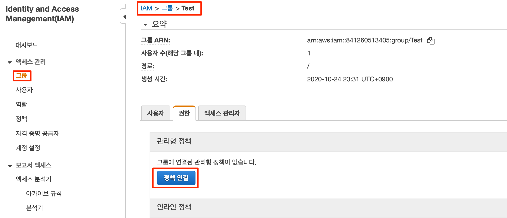

# IAM 정책\(Policy\)과 권한\(Permission\)

## IAM 정책 소개

IAM에서 자격 증명에 대한 권한을 설정해야 할 경우 AWS 관리형 정책, 고객 관리형 정책 또는 인라인 정책 중 어느 것을 사용할지를 결정해야 합니다.

### AWS 관리형 정책 \(AWS Managed Policy\)

**AWS 관리형 정책**은 AWS에서 생성 및 관리하는 독립적인 정책입니다. 여기에서 독립적인 정책이란 정책 스스로 정책 이름이 포함된 Amazon 리소스 이름\(ARN\)을 갖고 있다는 것을 의미합니다. AWS 에서 대부분 제공되는 정책입니다. AWS에서 제공되는 정책이므로 글로벌하게 적용됩니다.

예를 들어 `arn:aws:iam::aws:policy/IAMReadOnlyAccess`는 AWS 관리형 정책입니다.

![\[AWS &#xAD00;&#xB9AC;&#xD615; &#xC815;&#xCC45;\]](.gitbook/assets/image%20%2810%29.png)


### AWS 고객 관리형 정책 \(AWS Customer Managed Policy\)

독립적인 정책은 사용자 자신의 AWS 계정에서 관리하도록 생성할 수도 있습니다. 이러한 정책을 고객 관리형 정책이라고 합니다. 이렇게 생성된 정책은 AWS 계정에 속한 다수의 보안 주체 엔터티에 추가할 수 있습니다. 정책을 보안 주체 엔터티에 추가할 경우 정책에서 정의한 권한까지 엔터티에게 부여하게 됩니다.

고객이 관리하는 정책을 생성하는 좋은 방법은 AWS에서 관리하는 기존의 정책을 복사하여 시작하는 것입니다. 이렇게 하면 시작 시 올바른 정책으로 시작하므로 해당 환경에 맞게 사용자 지정만 하면 됩니다. 고객 관리형 정책은 만들어진 Account에서만 사용할 수 있습니다.

![\[AWS &#xACE0;&#xAC1D; &#xAD00;&#xB9AC;&#xD615; &#xC815;&#xCC45;\]](.gitbook/assets/image%20%2824%29.png)


AWS 인라인 정책

AWS 인라인 정책은 1 to 1 정책으로 명시적으로 할당되는 정책입니다.따라서 IAM 자격 증명\(사용자, 그룹 또는 역할\)에 포함되는 정책입니다. 즉, 정책은 자격 증명의 고유한 부분입니다. Lab에서 명시적 접근 거부로 확인합니다.


## **사용자 권한 추가**

### 사용자 권한 추가

AWS 관리 콘솔에서 IAM을 선택하고, 대시보드에서 사용자를 선택합니다. Captain 사용자를 선택하고, 사용자 **권한 추가**합니다.



captain 사용자에 기존 정책 직접 연결을 선택합니다. captain에 "AdministratorAccess" 권한을 부여합니다.


정책을 연결하고 사용자에서 Captain을 선택하고, JSON 파일을 확인합니다.

```text
{
    "Version": "2012-10-17",
    "Statement": [
        {
            "Effect": "Allow",
            "Action": "*",
            "Resource": "*"
        }
    ]
}
```

정책 시뮬레이션을 선택합니다.


IAM 정책 시뮬레이션은 현재 적용된 정책이 어떤 권한을 가지고, 자원을 사용할 수 있는지를 평가해 주는 도구입니다.


이제 로그아웃을 하고, captain으로 Login을 합니다. 

앞서와 동일하게 사용자들에 대해 권한을 할당하고, 시뮬레이션을 실행해 봅니다. 예를 들어 아래와 같이 각 사용자들에 대해서 정책과 권한을 할당합니다. 사용자 doctor 와 spiderman, captain과 thanos은 동일한 permission Policy를 가지게 되므로, 구성시에 "기존 사용자에서 권한 복사"를 활용해 봅니다.

| User | Permission Policies |
| :--- | :--- |
| captain | AdministartorAccess |
| hulk | AmazonEC2ReadOnlyAccess |
| hawkeye | AmazonEC2FullAccess |
| ironman | AmazonS3FullAccess |
| blackpanther | AmazonS3ReadOnlyAccess |
| doctor | AmazonEC2FullAccess,AmazonS3FullAccessk,CloudWatchFullAccess |
| spiderman | AmazonEC2FullAccess,AmazonS3FullAccessk,CloudWatchFullAccess |
| thor | AmazonEC2ReadOnlyAccess,AmazonS3ReadOnlyAccess |
| thanos | AdministartorAccess |

### 사용자 권한 확인

이제 각 사용자들로 로그인을 통해 권한이 정상적으로 구성되고 동작하는지 확인해 봅니다.

* hulk - EC2 인스턴스를 생성해 봅니다. 아래와 같은 에러메세지를 출력합니다.


* hawkeye - EC2 인스턴스를 생성해 봅니다. 정상적으로 EC2 인스턴스를 생성할 수 있습니다. 하지만 S3 버킷을 생성할 수 없습니다.


* ironman - S3 버킷을 생성할 수 있습니다. 하지만 EC2에 대한 정책 권한이 없으므로 아래와 같이 에러가 발생합니다.


* blackpanther - S3를 조회할 수는 있지만, S3를 생성할 수 있는 정책 권한이 없으므로 아래와 같이 에러가 발생합니다.


* doctor, spiderman - 같은 정책권한을 소유하고 있습니다. EC2,S3 전체 정책 권한과 Cloudwatch에 대한 권한을 가지고 있으므로 접근이 가능합니다.
* thor - EC2,S3에 대한 접근권한과 Read권한을 가지고 있으므로 , 생성할 수는 없습니다.
* thanos - Admin권한을 가지고 있으므로 captain과 동일하게 모두 접근 가능합니다.

### 명시적 접근 거부

앞서 사용자 "hawkeye"는 관리형 정책을 통해 "AmazonEC2FullAccess" 정책에 대한 권한을 적용하였습니다.


